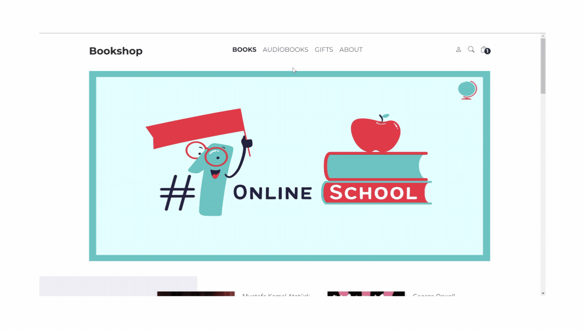

# E-Book

# Kullanılan Teknolojiler

- JS
- HTML
- CSS
- Toastr

# Özellikleri

- Kitapların detaylı bilgilerini (yazar, isim, fiyat, eski fiyat, açıklama, yıldız derecelendirmesi ve yorum sayısı) içerir.
- Kitapları türlerine göre filtreleme (Roman, Çocuk, Kişisel Gelişim, Tarih, Finans, Bilim, vb.).
- Kitapları sepete ekleme, sepetten kaldırma ve sepet içeriğini güncelleme.
- Sepet içeriğinin detayları, kitap bilgileri, miktar ve toplam fiyatı gösterir.
- Stok durumuna göre miktar güncelleme ve stok fazlası için uyarı mesajı.

# GIF

